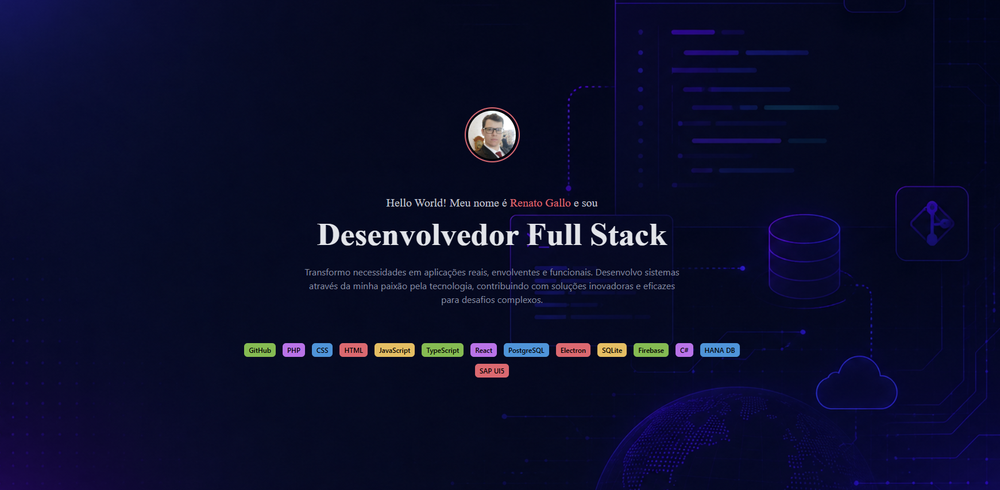

# Portfolio Dev

Aplicação de portfólio pessoal desenvolvida em **PHP** e **Tailwind CSS**, com foco em apresentação profissional de perfil, projetos e canais de contato.



## Visão geral

Este projeto foi estruturado para ser simples de manter, responsivo e direto ao ponto. A página principal é segmentada por componentes reutilizáveis para facilitar evolução do conteúdo e organização do código.

## Tecnologias

- PHP
- Tailwind CSS
- HTML5
- CSS3

## Estrutura do projeto

```text
portfolio-dev/
├── index.php
├── components/
│   ├── about.php
│   ├── contacts.php
│   └── projects.php
└── assets/
```

## Funcionalidades

- Seção “Sobre” para apresentação pessoal
- Seção de projetos com foco em destaque de trabalhos
- Seção de contato com acesso rápido às redes
- Layout responsivo para diferentes tamanhos de tela

## Como executar localmente

### Pré-requisitos

- PHP 8.0+ instalado e disponível no `PATH`

### Passos

```bash
git clone https://github.com/sahAlves/portfolio-dev.git
cd portfolio-dev
php -S localhost:8888
```

Abra no navegador: [http://localhost:8888](http://localhost:8888)

## Organização dos componentes

- `about.php`: conteúdo de apresentação
- `projects.php`: listagem/descrição de projetos
- `contacts.php`: links e informações de contato

## Autor

Desenvolvido por [@GalloJr](https://github.com/GalloJr)
